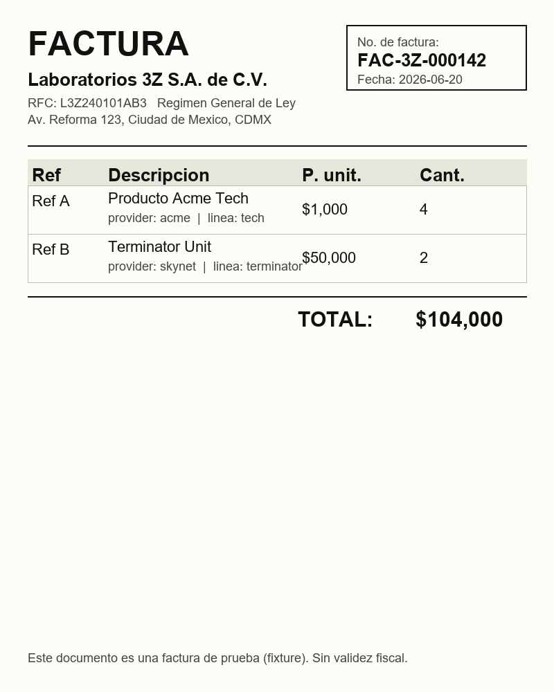

# Ejecuciones de prueba — Superlikers Telegram Ticket Bot (3z)

> **Workflow:** `BRG7YnCZ2GEpiO64` — "Superlikers: Telegram Ticket Bot (3z)" (51 nodos, FSM determinista)
> **Data Table de sesión:** `AsmN5sq4Pop0FVCi` (`wa_superlikers_sessions`)
> **Fecha de corrida:** 2026-06-24

## Qué son estas pruebas

Son **pruebas de SIMULACIÓN** ejecutadas con `test_workflow` + pin data del MCP de n8n. **No se publicó nada** y **no se pegó a ninguna API ni subworkflow real**.

El mecanismo de pin data fija la salida de los nodos que tocan el mundo externo, y deja correr **de verdad** todo lo demás. Concretamente:

| Se PINEA (salida simulada) | Corre DE VERDAD |
| --- | --- |
| `Telegram Trigger` (el update de entrada) | Toda la FSM: `Code` / `IF` / `Switch` |
| `Download Telegram Media` (credencial Telegram) | `Get Session` / `Persist Session` (Data Table real, aislada por `chatId` TEST*) |
| `Upload Photo` (HTTP Request) | `Merge Photo Results`, ruteo, decisiones |
| Subworkflows `executeWorkflow`: `Search Participant`, `Read Invoice (Vision)`, `Retail Buy`, `Accept Entry` | `Combine & Decide`, `Is Legible?`, `Is Ticket Duplicate?`, etc. |
| `Send Telegram Reply` (credencial Telegram) | |

> **Importante:** los nodos `executeWorkflow` **no** se auto-pinean. Para controlar las ramas sin disparar los subworkflows reales (búsqueda de participante, Vision, retail/buy, accept), se incluyeron explícitamente en la pin data con su salida canónica. Lo único que estas pruebas **no** cubren es el LLM real (Vision/NLU) y el e2e real punta a punta — eso se valida en vivo en el **Loom**.
>
> La pin data es por-ejecución y no deja indicador visual en el visor de ejecuciones de n8n.

## Resumen

| Caso | Estado esperado | executionId | Resultado |
| --- | --- | --- | --- |
| 1 — Usuario NUEVO (rama phone, no existe) | `awaiting_name`, `currentStep=3` | `1735` | **PASS** |
| 2 — Usuario EXISTENTE (salta a foto) | `awaiting_photo` | `1736` | **PASS** |
| 3 — Foto LEGIBLE → puntos | `completed`, `currentStep=9` | `1737` | **PASS** |
| 4 — Foto ILEGIBLE → pide otra (sin retail) | pide otra foto; `Retail Buy` NO corre | `1738` | **PASS** |
| 5 — DUPLICADO (sha1) | "ya fue registrado" | `1739` | **PASS** |

> Los casos 2, 4 y 5 terminan en estado `waiting` (no `success`) **a propósito**: dejan el status en `awaiting_photo`, así que la FSM entra a la rama de inactividad (`Wait 5min`) y suspende la ejecución esperando el recordatorio. La data de los nodos de assert ya es definitiva en ese punto.

---

## Caso 1 — Usuario NUEVO (rama phone, no existe)

**Input (redactado):** mensaje de texto `55••••5678` desde `chatId=TEST1`, sin fila de sesión previa.
`Search Participant` pineado con lista de participantes vacía.

**Salida — `Decide After Search`:**
```json
{
  "chatId": "TEST1",
  "phone": "55••••5678",
  "nextStep": 3,
  "distinctId": "",
  "name": "",
  "email": "",
  "replyText": "¡Hola! Para registrarte, ¿cuál es tu nombre completo?",
  "status": "awaiting_name"
}
```
**Salida — `Persist Session`:** `currentStep=3`, `status="awaiting_name"`.

**Qué prueba:** cuando el celular es válido pero no existe el participante, la FSM arranca el alta pidiendo el nombre y avanza el estado a `name` (3).

---

## Caso 2 — Usuario EXISTENTE (salta a foto)

**Input (redactado):** mensaje de texto `55••••5678` desde `chatId=TEST2`, sin fila previa.
`Search Participant` pineado con un participante encontrado (`distinct_id` redactado).

**Salida — `Decide After Search`:**
```json
{
  "chatId": "TEST2",
  "phone": "55••••5678",
  "nextStep": 6,
  "distinctId": "j••n@mail.com",
  "name": "Juan",
  "email": "j••n@mail.com",
  "replyText": "¡Te encontré! 📸 Mandame la foto de tu ticket o factura.",
  "status": "awaiting_photo"
}
```

**Qué prueba:** cuando el participante existe, la FSM se salta el alta (nombre/email/confirmación) y va directo a pedir la foto, dejando `status="awaiting_photo"` y `currentStep=6`. El `replyText` confirma el reconocimiento ("¡Te encontré!").

---

## Caso 3 — Foto LEGIBLE → puntos

**Input (redactado):** foto desde `chatId=TEST3` (fila sembrada en `awaiting_photo`, `currentStep=6`, `distinctId=t••t@mail.com`).
Pin: `Download Telegram Media` (file path), `Upload Photo` → `{id: "photo3"}` 200, `Read Invoice (Vision)` → factura legible `FAC-3Z-000142` con 2 productos, `Retail Buy` → `{points: 250}`, `Accept Entry` → ok.

**Salida — `Combine & Decide`** (verifica el fan-out + merge):
```json
{
  "sha1Taken": false,
  "activityId": "photo3",
  "legible": true,
  "ref": "FAC-3Z-000142",
  "products": [{ "ref": "A", "price": "1000", "quantity": "4" }, { "ref": "B", "price": "50000", "quantity": "2" }],
  "detected_type": "factura"
}
```
**Salida — `After Accept`:**
```json
{
  "chatId": "TEST3",
  "nextStep": 9,
  "invoiceRef": "FAC-3Z-000142",
  "photoActivityId": "photo3",
  "replyText": "🎉 ¡Listo! Ganaste 250 puntos.",
  "status": "completed"
}
```
**Salida — `Persist Session`:** `currentStep=9`, `status="completed"`.

**Qué prueba:** el camino feliz completo de la rama foto. El **fan-out** `Download → [Upload Photo, Read Invoice (Vision)]` y el `Merge` combinan correctamente (el `activityId` viene del Upload y `ref`/`products` de Vision). Con factura legible, no duplicada, retail OK y accept OK, se otorgan los 250 puntos y la sesión queda `completed` (9).

---

## Caso 4 — Foto ILEGIBLE → pide otra (sin retail)

**Input (redactado):** foto desde `chatId=TEST4` (fila sembrada `awaiting_photo`).
Pin: `Upload Photo` → `{id: "photo4"}` 200, `Read Invoice (Vision)` → `legible: false`, `detected_type: "selfie"`. **`Retail Buy` NO se pineó a propósito.**

**Salida — `Not Legible Reply`:**
```json
{
  "chatId": "TEST4",
  "nextStep": 6,
  "replyText": "Recibí un/a selfie, no un ticket 📷. Mandame una foto clara de tu factura (JPG/PNG).",
  "status": "awaiting_photo"
}
```

**Traza de nodos ejecutados (relevante):**
`… → Combine & Decide → Is Ticket Duplicate? (out 1) → Is Legible? (out 1) → Not Legible Reply → Persist Session → … → Wait 5min`

**Qué prueba:** cuando Vision marca la foto como ilegible, la FSM responde pidiendo una foto clara y **NO ejecuta la rama de monetización**. Verificado en el `runData` completo de la ejecución: **`Retail Buy` NO aparece** (tampoco `Accept Entry` ni `Route Retail Result`). El usuario sigue en `awaiting_photo`.

---

## Caso 5 — DUPLICADO (sha1)

**Input (redactado):** foto desde `chatId=TEST5` (fila sembrada `awaiting_photo`).
Pin: `Upload Photo` → `{error: "Sha1 is already taken"}` **statusCode 422**, `Read Invoice (Vision)` → factura legible `FAC-3Z-000142`.

**Salida — `Combine & Decide`** (detección de duplicado):
```json
{
  "sha1Taken": true,
  "activityId": "",
  "legible": true,
  "ref": "FAC-3Z-000142",
  "detected_type": "factura"
}
```
**Salida — `Duplicate Ticket Reply`:**
```json
{
  "chatId": "TEST5",
  "nextStep": 6,
  "replyText": "Ese ticket ya fue registrado antes ✋",
  "status": "awaiting_photo"
}
```

**Qué prueba:** aunque la factura sea legible, si el `Upload Photo` devuelve 422 con "Sha1 is already taken", `Combine & Decide` marca `sha1Taken=true` y la FSM corta antes de legibilidad/retail, avisando que el ticket ya fue registrado. El usuario queda en `awaiting_photo`.

---

## Trazabilidad

| Caso | executionId |
| --- | --- |
| 1 | `1735` |
| 2 | `1736` |
| 3 | `1737` |
| 4 | `1738` |
| 5 | `1739` |

- **workflowId:** `BRG7YnCZ2GEpiO64`
- **Data Table de sesión:** `AsmN5sq4Pop0FVCi` (`wa_superlikers_sessions`, project `ZBaqJyvdifxCV4uh`)
- Filas de sesión sembradas para la simulación: `chatId` ∈ {`TEST3`, `TEST4`, `TEST5`} (estado inicial `awaiting_photo`). Casos `TEST1` y `TEST2` se crean durante su propia corrida.

---

## Pruebas en vivo (webhook real) — bug encontrado y corregido

> A diferencia de los casos 1–5 (simulación con `test_workflow` + pin data), acá el workflow se **publicó** y se le escribieron **mensajes reales** desde Telegram. El `Telegram Trigger` recibe el update por el **webhook real** y la FSM responde sola. Esto destapó dos cosas que la simulación con pin data no podía ver: el manejo de `$env` en la instancia y la persistencia del `replyText`.

### 1. Quite de `$env` — la instancia es n8n Community self-hosted

Los workflows usaban `{{ $env.BASE_URL }}` para componer la URL de los endpoints Superlikers. En esta instancia **n8n Community self-hosted** las expresiones `$env` **no resuelven** (la variable no está expuesta al motor de expresiones), así que la URL quedaba vacía/rota y las llamadas HTTP fallaban antes de salir.

**Fix:** se reemplazó `$env.BASE_URL` por la URL **literal** `https://api.superlikerslabs.com/v1/...` en todos los workflows. Afectó:

- Subworkflow **Superlikers: Request** → nodo `Call Superlikers API`.
- Principal → nodo `Upload Photo` → `url: https://api.superlikerslabs.com/v1/photos`.

Aplicado en vivo y reflejado en los `.json` committeados. Verificado: ya no queda **ninguna** referencia `$env` en el workflow exportado.

### 2. Ejecución real `1741` — `Bad Request: message text is empty`

**Input (redactado):** el usuario mandó un `Hola` desde `chatId=7156•••85`. El update entró por el webhook real, la FSM corrió, pero el nodo **`Send Telegram Reply` falló** con:

```
Bad Request: message text is empty
```

**Causa raíz:** el `replyText` se calcula bien en los nodos `Code` de la FSM (p.ej. `Default To Phone` arma "¡Hola! Para empezar, pasame tu número…"), pero **`Persist Session` (Data Table) no tenía la columna `replyText`**. El nodo `upsert` devuelve la **fila guardada** (solo las columnas que existen en la tabla), así que al pasar de `Persist Session` → `Send Telegram Reply` el `replyText` **se perdía**: `Send Telegram Reply` leía `{{ $json.replyText }}` y recibía vacío → Telegram rechaza el `sendMessage` con texto vacío.

> Es un bug de **forma del dato post-Data Table**, invisible en la simulación: los casos 1–5 asertaban contra la salida de los nodos `Code` (donde `replyText` sí está), no contra lo que devuelve `Persist Session`.

### 3. Fix — columna `replyText` + mapeo en `Persist Session`

1. Se agregó la columna **`replyText` (string)** a la Data Table `AsmN5sq4Pop0FVCi` (`wa_superlikers_sessions`).
2. Se mapeó `replyText: {{ $json.replyText }}` en el nodo `Persist Session` (tanto en `columns.value` como en el `schema`).

Ahora `Persist Session` devuelve el `replyText` que `Send Telegram Reply` necesita río abajo.

### 4. Verificación — ejecución `1742`

Se corrió `test_workflow` (exec **`1742`**): `Persist Session` **ya devuelve `replyText`** en su salida. Confirmado el dato que faltaba.

### 5. Re-publicación y envío real del bot

Con el fix aplicado se **re-publicó** el workflow (`activeVersionId` `23bbcff0`). Se verificó **punta a punta** escribiendo un mensaje real al bot: respondió correctamente (`message_id` **6**). El bug de `message text is empty` ya no aparece.

### 6. PENDIENTE — bindear la credencial Bearer de Superlikers

Los endpoints reales de Superlikers (search / register / photos / buy / accept) siguen devolviendo error hasta que se **seleccione a mano** la credencial Bearer `[SL]: Jafet` (`SXkzMC9XmTKtBrB5`, `httpBearerAuth`) en el nodo `Call Superlikers API` del subworkflow **Request**. No es un bug: es una **limitación del MCP de n8n**, que no puede bindear auth genérica de HTTP — el método ya queda preconfigurado (`genericCredentialType` + `httpBearerAuth`), solo falta el clic en la UI. La FSM tolera ese error sin romperse (las ramas manejan el fallo de la API). Ver `docs/environment.md` → "n8n Community: sin `$env`".

### Trazabilidad — pruebas en vivo

| Evento | Referencia |
| --- | --- |
| Ejecución del bug (webhook real, `Hola`) | exec `1741` |
| Ejecución de verificación del fix | exec `1742` |
| `activeVersionId` tras re-publicar | `23bbcff0` |
| Mensaje real de respuesta del bot | `message_id` `6` |
| Columna agregada | `replyText` (string) en `AsmN5sq4Pop0FVCi` |

## Pruebas e2e REALES contra los endpoints de Superlikers (datos: Jafet Escobar)

Hasta acá las "ejecuciones" eran con **pin data**: nodos pineados, respuestas simuladas. Útil para validar el grafo, **inútil** para validar el contrato real con la API. Así que se hizo lo que había que hacer desde el principio: **disparar los endpoints de verdad**, con datos reales del tester (celular `55••••5678`, email `dev.automation@…technologies.com`, chat real de Telegram `7156•••85`). Cada celda de abajo es una **respuesta REAL capturada**, no una expectativa.

| Endpoint/Componente | Método | Exec | Resultado real | Hallazgo |
|---|---|---|---|---|
| `participants/search` | GET | `1751` | 404 `{"message":"Participante ... no encontrado","code_error":20}` | **BUG**: usaba **POST** → 405 (allows GET,HEAD). Corregido a **GET**. |
| NLU (Claude) | — | `1755` | `{field:confirmacion, value:si, next_action:avanzar}` "¡Perfecto!…" (8.2 s de LLM real) | **OK real** |
| `participants` (alta) | POST | `1764` | 422 `{"errors":{"tags":"no puede estar en blanco"},"code_error":21}` | **BUG**: la campaña `3z` exige `cedula`/`Ocupacion`/`tags` además de `name`/`email`/`celular`. `cedula`+`Ocupacion` ya aceptados; **`tags` requiere config del panel Superlikers** (los valores válidos salen de la lista de la campaña). |
| Vision **LEGIBLE** | — | `1771` | GPT-4.1 → `{legible:true, ref:"FAC-3Z-000142", products:[Ref A $1000 ×4 (tech/acme), Ref B $50000 ×2 (terminator/skynet)], detected_type:factura}` | **BUG**: `Safe Parse` no leía `output[0].content[0].text` (forma del **Responses API**) → `no_json`. Corregido. |
| Vision **ILEGIBLE** | — | `1773` | GPT-4.1 → `{legible:false, detected_type:"selfie", reason:"no_factura"}` | **OK real** |
| `retail/buy` | POST | `1775` | 404 `{"message":"Participante ... no encontrado","code_error":20}` | **OK** (no hay participante porque el alta no cerró por `tags`) |
| `entries/accept` | POST | `1777` | 404 `{"message":"Actividad no encontrada","code_error":40}` | **OK real** (id ficticio) |
| **Foto REAL del usuario** (webhook) | — | `1769` | El bot respondió de verdad (`message_id` 15): *"Recibí un/a desconocido…"*; rechazada por (a) el parser de Vision **pre-fix** y (b) `Upload Photo` sin credencial | Confirma el fix de `replyText` **EN VIVO**; queda pendiente bindear el Bearer en `Upload Photo` del principal |

### Lo que el testing REAL expuso (y la simulación NUNCA iba a agarrar)

Y acá está el punto, porque es el corazón de todo esto: **pinear nodos te da una falsa sensación de seguridad**. El grafo "pasaba", pero cuatro bugs estaban agazapados esperando a la primera llamada real. Cuatro. Que ninguna ejecución con pin data podía ver, **justamente porque pineaban los nodos** que había que probar:

1. **`replyText` perdido tras `Persist Session`** — el `Data Table` no devolvía el campo que `Send Telegram Reply` necesitaba río abajo. Con pin data el reply venía "puesto a mano" y nunca se notaba. → corregido (columna + mapeo).
2. **`participants/search` con POST → 405** — el endpoint real solo admite **GET/HEAD**. Una simulación con respuesta pineada jamás te dice el método equivocado. → corregido a **GET**.
3. **El alta exige campos del formulario de campaña** — `3z` no acepta un alta "mínima": pide `cedula`, `Ocupacion` y `tags`. → `cedula`+`Ocupacion` agregados y **aceptados por la API**; `tags` quedó como la única pieza pendiente porque **depende de la configuración de la campaña en el panel Superlikers** (los valores válidos los define la lista de la campaña, no el código).
4. **Vision `Safe Parse` no leía la forma del Responses API** — el nodo de OpenAI devolvía `output[0].content[0].text` y el parser buscaba `content`/`choices[0].message.content` → caía a `no_json` (legible:false). → corregido para leer `$json.output?.[0]?.content?.[0]?.text` primero.

**Los 4 quedaron corregidos**, salvo `tags`, que no es código: es configuración del panel de la campaña en Superlikers.

### Cómo se probó Vision sin pasar por todo Telegram

Para aislar el subworkflow de visión se montó un **harness** (`workflows/test-vision-harness.json`): `Manual Trigger` → `HTTP Request` (GET) que **baja la fixture desde GitHub raw** (`raw.githubusercontent.com/.../fixtures/invoice-illegible.png`) → `Execute Workflow` al subworkflow `Vision: Read Invoice` (GPT-4.1 **real**, `waitForSubWorkflow:true`). Así la lectura de factura se valida punta a punta con el modelo real, sin depender del bot ni del estado de la FSM. Cambiando la URL de la fixture (legible/ilegible) se cubren ambos caminos.

### Fixtures usadas




---

# Recreación + pruebas con el chat `715690785` (2026-06-25)

Los workflows habían sido borrados de la instancia n8n (solo sobrevivía el subworkflow `Superlikers: Request`). Se **recrearon desde las fuentes committeadas** vía el SDK de n8n (`create_workflow_from_code` + `validate_workflow` + verificación de `connections`) y se **re-testearon** simulando que el usuario escribe desde su chat real de Telegram `715690785`.

## Workflows recreados (IDs nuevos)

| Workflow | ID nuevo | Nodos | Credencial(es) auto-asignada(s) |
|---|---|---|---|
| `Superlikers: Telegram Ticket Bot (3z)` (principal) | `b3xPAom7g5D4fNJW` | 51 | telegramApi `[SL]: Jafet` (4 nodos) ✓ |
| `Vision: Read Invoice` | `OolJmLS6axxXNMNI` | 5 | openAiApi `[Sandbox]: Jafet` ✓ |
| `Conversation: Understand` | `BE5HDPv8zRivQn8D` | 8 | anthropicApi `[Sandbox]: Jafet` ✓ |
| `Superlikers: Retry Queue Worker` | `z4T5TV6ibkNb0dyZ` | 10 | slackOAuth2Api `Global PR` ✓ |
| `Superlikers: Request` (reutilizado) | `iMWPZE5gVhbc4Sge` | 4 | Bearer `[SL]: Jafet` (manual en UI) |

- El SDK encadenó el fan-out de la foto de forma lineal; se corrigió vía `update_workflow` (**removeConnection** `Merge[0]→Read Invoice` + **addConnection** `Download[0]→Read Invoice`), dejando el fan-out correcto `Download → {Upload Photo, Read Invoice}`. Verificado en la ejecución `1798` (Combine & Decide lee `activityId` de Upload **y** `legible/ref/products` de Vision).
- Las referencias `executeWorkflow` del principal se recablearon a los IDs nuevos de Vision/Conversation; el resto sigue apuntando a `iMWPZE5gVhbc4Sge`.

## Script de simulación

`scripts/simulate_conversation.py` construye los `update` de Telegram para `chat.id=715690785` y soporta dos modos: `--mode pindata` (para `test_workflow`) y `--mode webhook` (POSTea al webhook de producción; el bot responde en el chat real). Ver `scripts/README.md`.

## Pruebas de simulación (`test_workflow` + pin data, chat `715690785`)

Se pineó el `Telegram Trigger` con el update de `715690785`, `Get Session` con el estado de entrada y los `executeWorkflow`/HTTP de frontera con su salida canónica. La FSM (`Code`/`IF`/`Switch`) corrió **de verdad**. **Nota:** `Send Telegram Reply` **no** se pinea, así que cada caso **envió una respuesta real** al chat `715690785` (se ve en `result.message_id`).

| Caso | Estado esperado | executionId | Resultado |
|---|---|---|---|
| 1 — Usuario NUEVO (rama phone) | `awaiting_name`, `currentStep=3` | `1788` (success) | **PASS** — msg real `30` |
| 2 — Usuario EXISTENTE (salta a foto) | `awaiting_photo`, `currentStep=6` | `1797` (waiting) | **PASS** — msg real `39` |
| 3 — Foto LEGIBLE → puntos | `completed`, `currentStep=9`, 250 pts | `1798` (success) | **PASS** — fan-out OK |
| 4 — Foto ILEGIBLE → pide otra | pide otra; `Retail Buy` NO corre | `1799` (waiting) | **PASS** — sin monetización |
| 5 — DUPLICADO (sha1) | "ya fue registrado" | `1800` (waiting) | **PASS** |

`Persist Session` devuelve `replyText` en todos los casos (la columna existe y está mapeada): el fix del bug histórico sigue intacto.

## Pruebas e2e REALES (webhook publicado) — hallazgos

El bot está **publicado** y se le enviaron mensajes/fotos reales desde Telegram (`mode: webhook`). Hallazgos de la ejecución `1794` (foto real legible):

1. **Vision REAL funciona** (sub-exec `1795`): GPT-4.1 leyó la factura → `legible:true`, `ref:"FAC-3Z-000142"`, 2 productos. El fan-out alimenta a Vision con el binario correcto.
2. **Tono argentino → español neutro.** Los mensajes usaban voseo (`pasame`, `mandame`, `respondé`, `seguís`…). Se **neutralizaron** todos (tú, nunca vos) en el principal y en el `Blocked Response`/system prompt del NLU. Ver `prompts/messages/brand-templates.md` (v2).
3. **BUG de robustez corregido — `After Register` no verificaba el alta.** El alta real `POST /participants` devolvió **422** `{"errors":{"tags":"no puede estar en blanco"},"code_error":21}` (exec `1791` → sub-exec `1793`), pero `After Register` avanzaba a `awaiting_photo` diciendo *"¡quedaste registrado!"*. Tres pasos después, `/photos` y `/retail/buy` daban **404** "Participante no encontrado" y el bot respondía un confuso *"Hubo un problema registrando tu compra"*. **Fix:** `After Register` ahora chequea `Register Participant.ok`; si falló, responde honesto y deja `manual_review` **sin** avanzar a foto.
4. **BLOQUEO EXTERNO — `tags` de la campaña `3z`.** El alta exige un valor de `tags` que **debe existir en la lista configurada de la campaña en el panel de Superlikers**. El valor `qa-telegram` no es válido → la campaña lo trata como vacío (`422`). **Sin un `tags` válido, el participante no se crea y la foto legible no puede otorgar puntos end-to-end.** Esto es configuración del panel (externa al código), no un bug del workflow.

### Trazabilidad — e2e real (chat `715690785`)

| Evento | Referencia |
|---|---|
| Confirmación NLU real (Claude) | exec `1791` → sub-exec `1792` |
| Alta real `POST /participants` → 422 `tags` | sub-exec `1793` |
| Foto real legible (Vision OK, photo/buy 404) | exec `1794` → Vision sub-exec `1795`, buy sub-exec `1796` |

> **Pendiente del dueño (admin@arthromed):** indicar un valor de `tags` válido de la campaña `3z` (o configurarlo en el panel). Con eso, el alta cierra y la foto legible otorga puntos de punta a punta.
